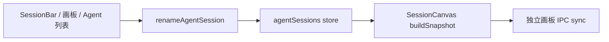
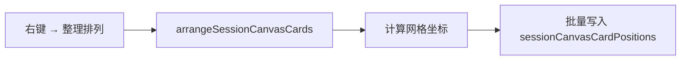
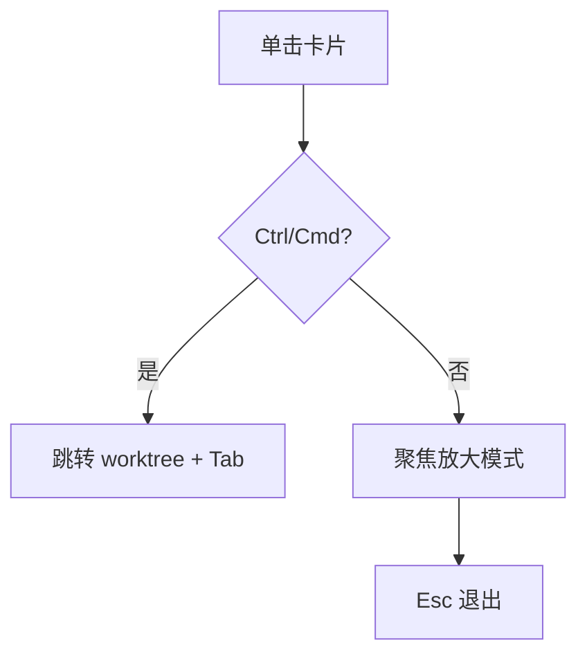

# 会话画板 UX 改进 — OpenCove 借鉴与讨论稿

**日期**: 2026-06-02  
**状态**: 讨论稿（未开工）  
**版本基线**: EnsoAI **v0.2.51**（独立画板窗口、预览权威刷新、卡片拖动、画板内双击改名）  
**参考**: 仓库内 `opencove/`（OpenCove Workspace Canvas）  
**关联**: `2026-06-01-session-canvas-design.md`、`2026-06-02-session-canvas-opencove-design-discussion.md`

---

## 0. 用户反馈摘要（本轮）

先肯定：当前画板方向整体可用；本轮聚焦 **交互是否「像专业看板」**，希望持续向 OpenCove 看齐，而不是堆新功能。

| # | 需求 | 一句话 |
|---|------|--------|
| **R1** | **会话改名全局生效** | 在「正常主界面」改会话名，画板 / SessionBar / 各处标题一致；不要只在画板里改名 |
| **R2** | **右键一键整理** | 画布空白或卡片上右键 →「整理排列」，按规则排齐，不要随机散落 |
| **R3** | **默认点击 = 放大预览；Ctrl+点击 = 跳转会话** | 单击卡片：在当前画板内放大（约 2× 或占可视区 ~50%）；**Ctrl+左键** 才切 worktree 并打开 Agent/Terminal |

**暂不纳入本轮**（用户口头提过又收回）：关闭按钮是否退出整个应用、画板是否完全独立产品等，留后续单独立项。

---

## 1. OpenCove 看板相关能力 — 可借鉴清单

OpenCove 的「看板」是 **无限 2D 工作台**（`@xyflow/react`），终端/Agent/任务/笔记都是 **Node**，与 EnsoAI「会话卡片列表」形态不同，但 **交互意图** 可对齐。

### 1.1 命名 / 重命名

| OpenCove | 路径/机制 | 可借鉴点 |
|----------|-----------|----------|
| 终端/Agent 节点标题 | `nodeTypes.terminal.tsx` → `onTitleCommit` → `renameTerminalTitle` | 改名写回 **节点数据**，全画布同步 |
| Space 分支重命名 | `WorkspaceSpaceBranchRenameDialog.tsx` | 独立对话框 + 校验，改名是 **显式动作** |
| Explorer 内重命名 | `WorkspaceSpaceExplorerOverlay.*` | 列表与画布共用同一数据源 |

**启示**：名称的 **唯一数据源** 在 store；任何入口（侧栏、画板、弹窗）都只调同一 `rename` API。

### 1.2 整理排列（Arrange）

| OpenCove | 路径/机制 | 可借鉴点 |
|----------|-----------|----------|
| 画布右键菜单 | `WorkspaceContextMenu.tsx` + `WorkspaceContextArrangeBySubmenu.tsx` | **Arrange** 子菜单：作用域 + 排序规则 + 空间贴合 |
| 排列算法 | `workspaceArrange.canvas.ts`、`workspaceArrange.shared.ts` | 固定 `GAP=24px`、`GRID=24px` 网格吸附；`order: position \| created \| semantic` |
| 作用域 | `ArrangeScope`: `all` / `canvas` / `space` | 可整理整画布或某一 Space 内节点 |
| 快捷入口 | `commitArrangeAndClose` 一键执行当前选项 | 除子菜单外，支持 **一键整理** |

**启示**：整理 = **确定性布局函数**（输入：卡片列表 + 尺寸 + 容器宽高 → 输出：每张卡的 x,y），而不是依赖用户上次拖到哪。

### 1.3 点击 vs 聚焦 / 视口

| OpenCove | 路径/机制 | 可借鉴点 |
|----------|-----------|----------|
| 节点交互开始 | `nodeTypes.terminal.tsx` → `onInteractionStart` | 默认：`selectNode` + **`normalizeViewportForTerminalInteraction`**（把节点滚到视口舒适区域） |
| 修饰键 | `shiftKey` 多选；Explorer 里 `ctrl/meta` 组合键 | **修饰键改变语义**，普通点击不离开画布 |
| Quick Preview | `useSpaceExplorer.quickPreviewActions.ts`、`WorkspaceSpaceQuickPreview.tsx` | 先 **浮层预览**，再决定是否 materialize 成节点 |

**启示**：**单击 = 在看板语境下「展开/聚焦」**；**跳转/打开实体** 应用修饰键或二级操作（双击、按钮）。

### 1.4 EnsoAI 不宜照搬的部分

| OpenCove 能力 | 为何不直接搬 |
|---------------|------------|
| 无限画布 + React Flow | 会话画板定位是「轻量总览」，首版不引入 xyflow |
| 节点内 live xterm | PTY 单例，画板仍用文本预览（见 0.2.50 设计边界） |
| Worker `presentationSnapshot` | 可作为预览真相的 **长期方向**，本轮先用 xterm 权威快照（0.2.51 已做） |

---

## 2. EnsoAI 现状（v0.2.51）

| 能力 | 现状 | 与目标差距 |
|------|------|------------|
| 改名 | 主界面 `AgentPanel.handleRenameSession` 写 `userRenamed`；画板 **双击** 也可改名（仅主窗口，写同一 store） | 独立画板窗口 **未** 接 IPC 改名；SessionBar 与画板标题逻辑需 **统一入口** |
| 排列 | 首次默认 3 列网格；之后 **自由拖动** 持久化 `sessionCanvasCardPositions` | 无「整理」；拖乱后只能手动摆 |
| 点击 | **整卡点击 = 跳转** worktree + 切 Tab | 与 R3 相反：应先放大预览 |
| 右键 | 无 | 缺 R2 |
| 放大 | 仅右下角 resize 手柄改卡片宽高 | 无「聚焦放大到半屏」模式 |

---

## 3. 需求方案（供讨论）

### 3.1 R1 — 会话改名全局生效

**目标**：任意合法入口改名后，`SessionBar`、Agent 面板 Tab、`SessionCanvas` 卡片标题、IPC 快照中的 `title` 一致。

**建议单一 API**（主进程 / renderer 共用逻辑）：

```text
renameAgentSession(sessionId, name)
  → updateSession(id, { name, terminalTitle: undefined, userRenamed: true })
  → 触发 sessionCanvasPanel.sendSync（若画板窗口打开）
```

| 入口 | 行为 |
|------|------|
| **SessionBar**（已有） | 保持；确保 `getDisplaySessionName` 与画板 `resolveSessionCanvasCardTitle` 规则一致 |
| **Agent 面板会话列表**（已有 `handleRenameSession`） | 保持 |
| **画板卡片** | 改为与 SessionBar 相同：**双击或右键「重命名」** → 内联输入 / 小弹层 |
| **独立画板窗口** | 通过 IPC `sessionCanvasPanel.renameSession` 转发到主窗口 store，再 `sendSync` 回子窗口 |

**标题显示规则**（与现逻辑对齐，写进规范）：

1. `userRenamed === true` → 显示 `session.name`
2. 否则 → `session.terminalTitle || session.name`（工具 OSC 名优先）

**不在画板单独存「画板专用名」**，避免两套真相。

---

### 3.2 R2 — 右键「一键整理排列」

**目标**：空白处或卡片上右键，提供 **「整理排列」**（可译 `Arrange cards`），一键把当前可见卡片排成整齐网格。

**参考 OpenCove**：`arrangeWorkspaceCanvas` + `WORKSPACE_ARRANGE_GAP_PX = 24`。

**EnsoAI 简化版（MVP）**：

| 项 | 建议值 |
|----|--------|
| 算法 | 按 **当前过滤后的卡片顺序**（agent 在前 / 创建时间 / 名称，待选）从左到右、从上到下铺网格 |
| 列数 | `cols = max(1, floor((containerWidth - padding) / (cardWidth + gap)))` |
| 间距 | `gap = 12`（与现 `getDefaultCardPosition` 一致） |
| 尺寸 | 保留每张卡已有 `sessionCanvasCardSizes`，或整理时 **统一为默认 320×300**（待选） |
| 写入 | 批量 `setSessionCanvasCardPosition` |

**右键菜单草案**：

```text
[ 整理排列 ]
────────────
[ 重命名 ]          ← 仅 Agent 卡，且非 external 模式
[ 跳转到会话 ]      ← Ctrl+点击 的等价项
────────────
[ 重置为默认布局 ]  ← 可选：清 position + size
```

**作用域**（对齐 OpenCove 子集）：

- 首版仅 **当前画板内全部卡片**（过滤后）
- 不做「按仓库分子区域」（后续若有分组再扩展）

---

### 3.3 R3 — 点击语义：放大 vs 跳转

**目标行为**：

| 操作 | 行为 |
|------|------|
| **普通单击** | 进入 **聚焦模式（Focus Card）**：该卡放大至约 **可视区域 50% 宽**（或宽高各 ~1.8–2×），居中；其余卡片弱化（遮罩或降 opacity）；预览区可读性优先 |
| **Ctrl + 单击**（macOS 可用 Cmd） | 保持现逻辑：`onFocus` → 选 worktree → 切 Tab → Agent/Terminal |
| **Esc** | 退出聚焦模式 |
| **聚焦模式下 Enter / 双击** | 可选：等价于跳转（待选） |

**参考 OpenCove**：

- `normalizeViewportForTerminalInteraction` ≈ 把关注点移到当前节点
- Quick Preview ≈ 临时大图阅读，不立刻打开完整终端

**实现层级（建议）**：

```text
SessionCanvasPanel
  focusedCardKey: string | null
  onCardClick(item, event)
    if (event.ctrlKey || event.metaKey) → handleFocus(item)
    else → setFocusedCardKey(item.key)
```

**聚焦 UI 草案**：

- 半透明 backdrop 覆盖画板
- 中央单卡：宽度 `min(90vw, max(640, 0.5 * panelWidth))`，高度 `min(80vh, 0.55 * panelHeight)` 或固定比例
- 卡片内预览 `SessionCanvasPreview` 占满剩余空间
- 角标提示：`Ctrl+点击跳转会话` / `Esc 关闭`

**与 resize 手柄关系**：

- 聚焦模式下仍可 resize（可选）或锁定尺寸仅放大容器（待选，建议 **聚焦用临时尺寸，不写 store**，退出聚焦恢复）

---

## 4. 交互流程（Mermaid）

### 4.1 改名



### 4.2 整理排列



### 4.3 点击



---

## 5. 分期建议（讨论后拍板）

| 阶段 | 内容 | 预估 |
|------|------|------|
| **P0** | R1 全局改名统一 + 独立窗口 IPC | 小 |
| **P1** | R3 聚焦放大 + Ctrl 跳转 | 中 |
| **P2** | R2 右键菜单 + 一键整理 | 中 |
| **P3** | 整理选项增强（排序规则、统一尺寸、重置布局） | 小 |
| **远期** | 对齐 OpenCove Worker 快照、画布平移缩放 | 大 |

**推荐实施顺序**：**P0 → P1 → P2**（先改「点起来不对」，再补「摆整齐」）。

---

## 6. 已确认（2026-06-02）

| # | 问题 | 决定 |
|---|------|------|
| 1 | 整理时卡片尺寸 | **统一** 320×300 |
| 2 | 整理排序依据 | **仓库路径** `localeCompare` |
| 3 | 聚焦放大比例 | **固定占画板 60%** |
| 4 | 跳转修饰键 | **Ctrl / Cmd + 单击** |
| 5 | 独立画板改名 | **必须支持**（IPC → 主窗口 store → `sendSync`） |
| 6 | Terminal 改名 | **支持**（`terminal.title`） |

**实现版本**：`0.2.52`（P0+P1+P2 已落地）

---

## 7. 与 OpenCove 对照总表

| 能力 | OpenCove | EnsoAI 建议（本轮） |
|------|----------|---------------------|
| 数据源 | Node store + Worker | `agentSessions` / `terminal` store + IPC 快照 |
| 改名 | `onTitleCommit` | 统一 `renameAgentSession` |
| 整理 | `arrangeCanvas` + 子菜单 | 右键一键 `arrangeSessionCanvasCards` |
| 单击 | 选中 + 视口 normalize | 聚焦放大 |
| 跳转 | 双击/打开 Agent/切换 session | **Ctrl+单击** |
| 右键 | 丰富上下文菜单 | 精简：整理 / 重命名 / 跳转 |

---

## 8. 结论

三项需求已在 **不改成 OpenCove 式无限画布** 的前提下落地：**全局改名 + IPC**、**单击聚焦 60% / Ctrl|Cmd 跳转**、**右键整理（仓库路径排序、统一尺寸）**。

若需调整交互细节，在 **0.2.52** 基础上迭代即可。
